

# Sitio web de turismo espacial

🪐 Mi solución para el famoso desafío de Frontend Mentor "Turismo espacial", hecho con React. Esta es una solución al [desafío del sitio web de turismo espacial en Frontend Mentor](https://www.frontendmentor.io/challenges/space-tourism-multipage-website-gRWj1URZ3).

[Solución](https://www.frontendmentor.io/solutions/space-tourism-solution-in-react-iDp0nhXJI0) . [Página en vivo](https://space-tourism-xo25.onrender.com/)

## Descripción general

### El desafío

Los usuarios deben poder:

- Ver cada página y alternar entre las pestañas para obtener nueva información.
- Consultar el diseño óptimo para cada una de las páginas del sitio web, dependiendo del tamaño de pantalla de su dispositivo.
- Visualizar estados de desplazamiento para ver todos los elementos interactivos en la página.

### Capturas de pantalla

<table>
        <tr>
		    <td>
                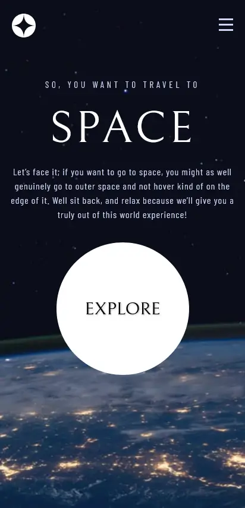
            </td>
			<td>
                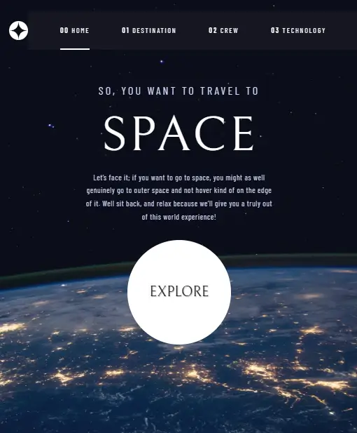
            </td>
            <td>
                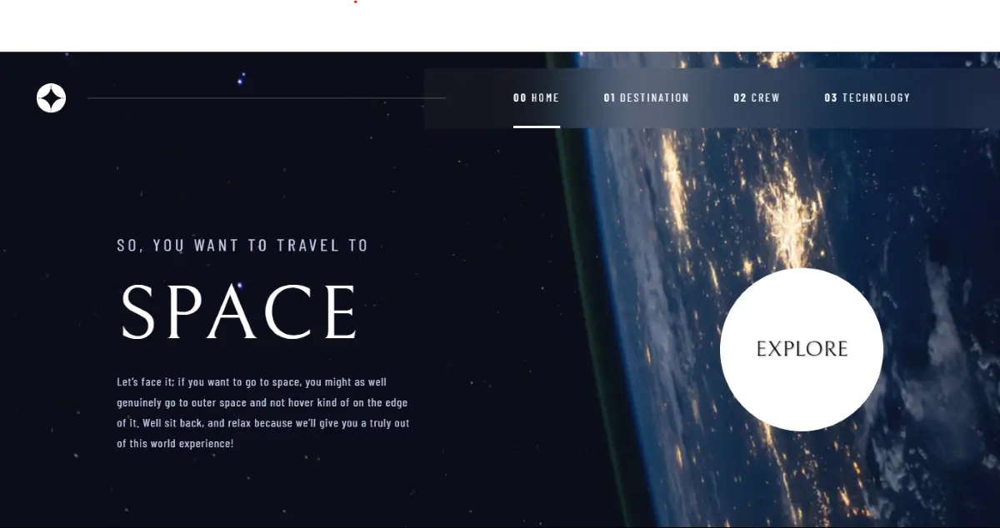
            </td>
        </tr>
        <tr>
		    <td>
                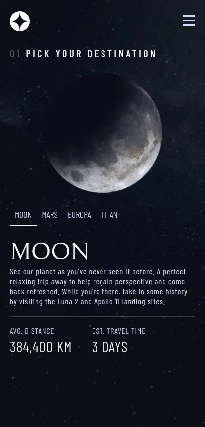
            </td>
			<td>
                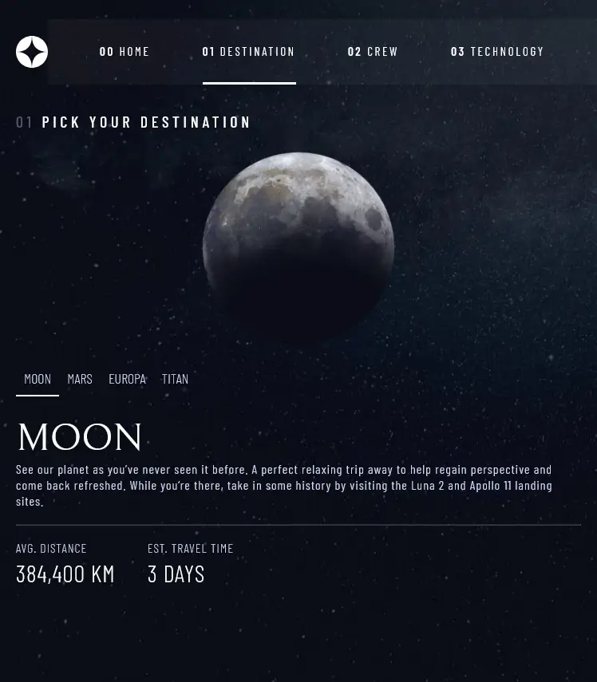
            </td>
            <td>
                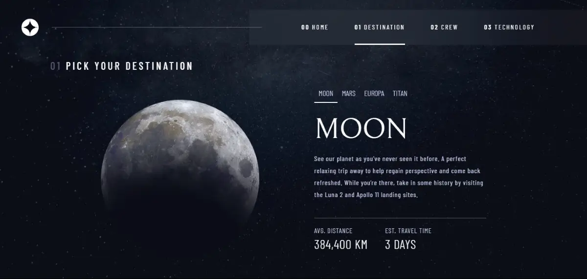
            </td>
        </tr>
        <tr>
		    <td>
                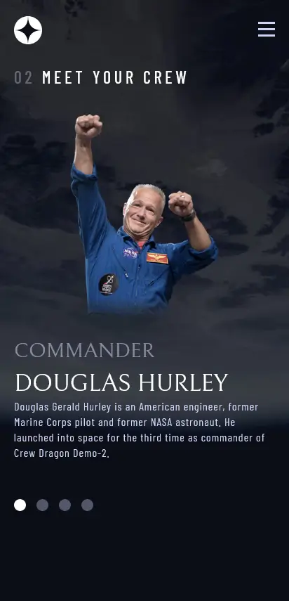
            </td>
			<td>
                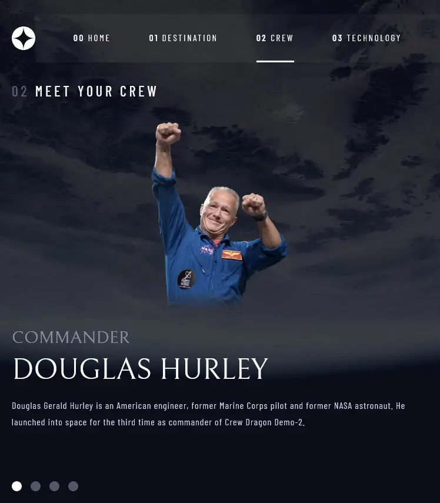
            </td>
            <td>
                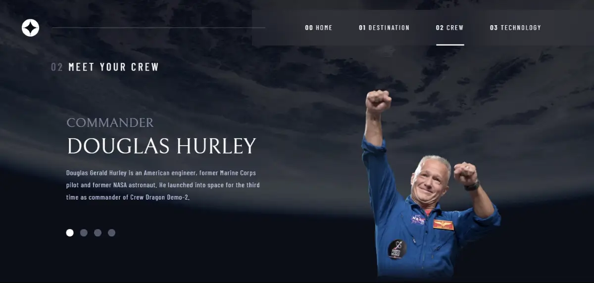
            </td>
        </tr>
        <tr>
		    <td>
                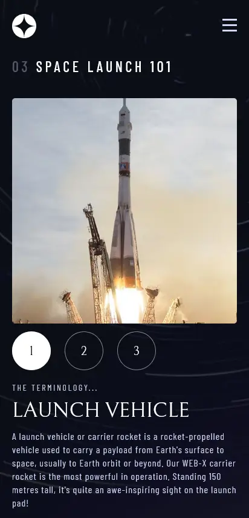
            </td>
			<td>
                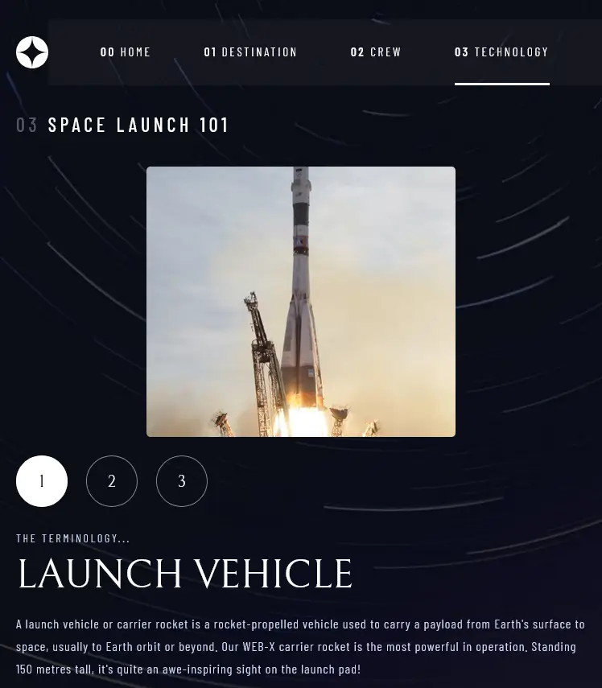
            </td>
            <td>
                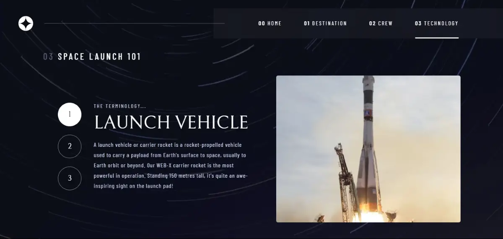
            </td>
        </tr>
</table>

### Enlaces

- [Solución](https://www.frontendmentor.io/solutions/space-tourism-solution-in-react-iDp0nhXJI0)
- [Página en vivo](https://space-tourism-xo25.onrender.com/)

## Mi proceso

### Tecnologías Utilizadas

- React
- React Router DOM
- HTML5
- CSS

<a href="#top">⬆️ Volver arriba</a>

### Lo que aprendí

El reto de Space Tourism de Frontend Mentor fue una excelente oportunidad para mantenerme en forma con mis habilidades en React. La implementación de los estilos y la navegación no fue tan complicada, gracias a mi experiencia previa con React y React Router DOM. Creé nuevos hooks reutilizables, lo que realmente me gustó y ayudó a optimizar el código. En general, fue un reto muy enriquecedor que me motivó a seguir mejorando.

<a href="#top">⬆️ Volver arriba</a>

## Autor

- [Mi sitio web](https://portfolio-anibal-quintero.vercel.app/)
- [Frontend Mentor](https://www.frontendmentor.io/profile/Anibal-quintero)

<a href="#top">⬆️ Volver arriba</a>

