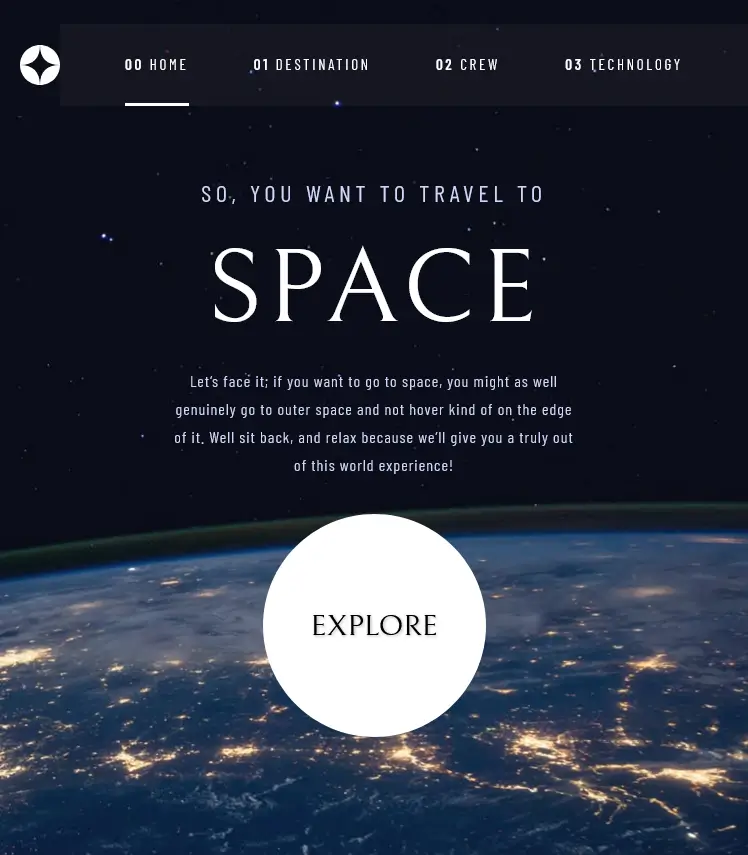

<a href="mailto:cosmohydra17@gmail.com"></img></a>

# Sitio web de turismo espacial

 🪐 Mi solución para el famoso desafío de Frontend Mentor "Turismo espacial", hecho con React y CSS. Esta es una solución al [desafío del sitio web de turismo espacial en Frontend Mentor](https://www.frontendmentor.io/challenges/space-tourism-multipage-website-gRWj1URZ3).

[Solución][solution-url] . [Página en vivo](https://space-tourism-xo25.onrender.com/)

## Descripción general

### El desafío

Los usuarios deben poder:

- Ver el diseño óptimo para cada una de las páginas del sitio web según el tamaño de pantalla de su dispositivo
- Ver los estados de hover para todos los elementos interactivos en la página
- Ver cada página y poder alternar entre las pestañas para ver nueva información

### Capturas de pantalla

<table>
        <tr>
		    <td>
                
            </td>
			<td>
                
            </td>
            <td>
                
            </td>
        </tr>
        <tr>
		    <td>
                
            </td>
			<td>
                
            </td>
            <td>
                
            </td>
        </tr>
        <tr>
		    <td>
                
            </td>
			<td>
                
            </td>
            <td>
                
            </td>
        </tr>
        <tr>
		    <td>
                
            </td>
			<td>
                
            </td>
            <td>
                
            </td>
        </tr>
</table>

### Enlaces

- [Solución][solution-url]
- [Página en vivo][live-page]

## Mi proceso

### Construido con

- Flujo de trabajo mobile-first
- Marcado semántico HTML5
- [React](https://reactjs.org/) - Biblioteca JS

<a href="#top">⬆️ Volver arriba</a>

### Lo que aprendí

Este desafío fue una gran oportunidad para mantenerme en forma haciendo proyectos con React. Los estilos y las animaciones no me resultaron tan difíciles, ya que estoy acostumbrado a trabajar con React y React Router DOM. Aprendí mucho y disfruté el proceso.

<a href="#top">⬆️ Volver arriba</a>

## Autor

- Mi sitio web - [cosmoart.vercel.app](https://cosmoart.vercel.app)
- Frontend Mentor - [@CosmoArt](https://www.frontendmentor.io/profile/cosmoart)

<a href="#top">⬆️ Volver arriba</a>

[live-page]: https://space-tourist.vercel.app
[solution-url]: https://www.frontendmentor.io/solutions/space-tourism-solution-in-nextjs-OMUOrt3m__
